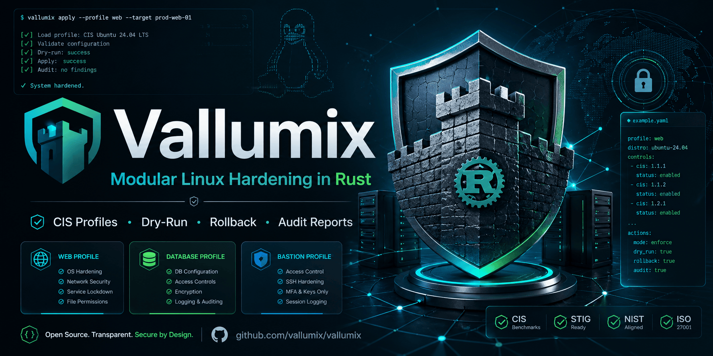

# Vallumix

[](https://github.com/jorgealonsodev/vallumix/actions/workflows/ci.yml)
[](https://github.com/jorgealonsodev/vallumix/actions/workflows/docs.yml)
[](https://crates.io/crates/vallumix)
[](https://docs.rs/vallumix)
[](LICENSE-MIT)
[](https://blog.rust-lang.org/2023/12/28/Rust-1.75.0.html)

<p align="center">
  
</p>

**Vallumix is a modular Linux hardening engine that automates CIS Benchmark compliance through a single static binary.** Written in Rust and designed for production environments, it applies idempotent security controls, generates auditable reports, and rolls back changes safely — all without runtime dependencies or interpreters.

## Why Vallumix?

- **Single static binary** compiled with `musl`: zero runtime dependencies, copy to any supported Linux server and run.
- **CIS-aligned controls**: 70+ controls mapped to CIS Benchmark Level 1 and Level 2, covering SSH, networking, filesystems, services, and authentication.
- **Safe rollback**: Every change is backed up before application. Revert an entire session or a single control instantly.
- **Role-based profiles**: Built-in `web`, `database`, and `bastion` profiles tailor controls to the server's purpose.
- **Multiple report formats**: HTML (self-contained), JSON, JUnit XML, and plain text for CI/CD integration.
- **Rust guarantees**: Memory safety at compile time, explicit error handling, and fearless concurrency for parallel checks.

## Quick Start

### Install from crates.io

```bash
cargo install vallumix
```

### Install from package

**Debian / Ubuntu (.deb)**

Download the latest `.deb` from [GitHub Releases](https://github.com/jorgealonsodev/vallumix/releases) and install:

```bash
sudo dpkg -i vallumix_*.deb
```

**RHEL / Rocky / AlmaLinux (.rpm)**

Download the latest `.rpm` from [GitHub Releases](https://github.com/jorgealonsodev/vallumix/releases) and install:

```bash
sudo rpm -i vallumix-*.rpm
```

### Direct download

Download the pre-built `musl` binary for your architecture from [GitHub Releases](https://github.com/jorgealonsodev/vallumix/releases), make it executable, and run:

```bash
chmod +x vallumix
sudo ./vallumix --help
```

## Usage Examples

### Preview changes without applying them

```bash
sudo vallumix apply --profile web --dry-run --verbose
```

### Audit compliance and generate an HTML report

```bash
sudo vallumix audit --profile web --report html --output /var/www/html/compliance.html
```

### Rollback a previous session

```bash
sudo vallumix rollback --session <session-id>
```

## Comparison with Other Tools

| Feature | Vallumix | OpenSCAP | Lynis | Ansible Lockdown |
|---|---|---|---|---|
| **Language** | Rust | C / Python | Shell / C | Python (Ansible) |
| **Distribution** | Single static binary | Packages + SCAP content | Script / package | Roles + controller |
| **Applies changes** | Yes | Yes | No (audit only) | Yes |
| **Role-based profiles** | Yes, built-in | SCAP content | Custom profiles | CIS roles |
| **Rollback** | Yes | No | No | No |
| **Report formats** | HTML, JSON, JUnit, Text | HTML, ARF, XCCDF | Text, JSON | None built-in |
| **Memory safety** | Yes (Rust) | No | No | No |
| **Parallel execution** | Yes (`rayon`) | No | No | Limited |

## Documentation

- **User Guide & Reference**: [https://jorgealonsodev.github.io/vallumix/](https://jorgealonsodev.github.io/vallumix/)
- **API Documentation**: [https://docs.rs/vallumix](https://docs.rs/vallumix)
- **Contributing**: See [CONTRIBUTING.md](CONTRIBUTING.md)
- **Security Policy**: See [SECURITY.md](SECURITY.md)

## Architecture

Vallumix is organized as a Cargo workspace with five crates:

```
+------------------+
|  vallumix-cli    |
|  (CLI / binary)  |
+--------+---------+
         |
         v
+------------------+
|  vallumix-core   |
|  (traits, engine)|
+--------+---------+
         ^
         |
+--------+---------+  +------------------+  +------------------+
|vallumix-controls |  |vallumix-reporters|  | vallumix-backup  |
| (CIS rules)      |  | (HTML/JSON/...)  |  | (rollback)       |
+------------------+  +------------------+  +------------------+
```

## Supported Platforms

- Debian 12
- Ubuntu 22.04 LTS / 24.04 LTS
- Red Hat Enterprise Linux 9
- Rocky Linux 9
- AlmaLinux 9

Architectures: `x86_64`, `aarch64` (ARM64)

## Contributing

We welcome contributions! Please read [CONTRIBUTING.md](CONTRIBUTING.md) for details on setting up your development environment, adding new CIS controls, and submitting pull requests.

## License

This project is licensed under either of:

- [MIT license](LICENSE-MIT)
- [Apache License, Version 2.0](LICENSE-APACHE)

at your option.
