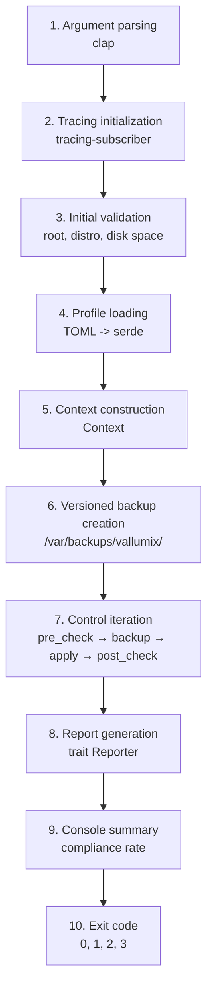

# Key Concepts

Before running Vallumix, it is important to understand the concepts that govern its operation. This section explains the mental architecture of the system: profiles, controls, idempotency, rollback, and the complete execution flow.

## Execution Flow

Every time you run Vallumix, the engine follows a 10-phase pipeline designed to be predictable, safe, and auditable:



This flow guarantees that each execution is autonomous: it validates the environment, backs up before modifying, verifies after applying, and documents everything in a structured report.

## What Does Each Phase Mean?

1. **Argument parsing:** `clap` validates flags, subcommands, and values. If there is a syntax error, the program aborts before touching the system.
2. **Tracing initialization:** configures the log level and format (colored text or structured JSON) according to `RUST_LOG` and `--log-level`.
3. **Initial validation:** checks that the user is root, that the distribution is supported by reading `/etc/os-release`, and that there is enough disk space for backups.
4. **Profile loading:** deserializes the TOML file of the selected profile (`web.toml`, `database.toml`, or `bastion.toml`) and resolves the list of controls to execute.
5. **Context construction:** gathers host information (hostname, kernel, distribution) and configures it in a `Context` structure that each control will receive.
6. **Backup creation:** generates a versioned directory with a timestamp in `/var/backups/vallumix/`. All modified files are copied here before any changes.
7. **Control iteration:** for each control in the profile, the engine executes `pre_check` (does it already comply?), `backup` (file copies), `apply` (applies change), and `post_check` (did it work?). In `audit` mode, only `pre_check` is executed.
8. **Report generation:** the `Reporter` traits produce the requested formats (HTML, JSON, JUnit, text).
9. **Console summary:** shows the compliance rate, approved, failed, and skipped controls, along with the path to the HTML report.
10. **Exit code:** `0` if it meets the threshold, `1` if not, `2` for configuration errors, `3` for privilege errors.

## Related Concepts

- **[Profiles](profiles.md):** preconfigured sets of controls adapted to the server's role.
- **[Controls](controls.md):** atomic units of verification and remediation, each implementing the `Control` trait.
- **[Idempotency](idempotency.md):** property that guarantees running Vallumix multiple times produces the same final state.
- **[Rollback](rollback.md):** mechanism to revert applied changes through versioned backups.

```tip
Understanding this flow helps you interpret logs, diagnose failures, and explain to an auditor how the tool works. You do not need to memorize it, but keep it as a reference when reviewing a problematic execution.
```
