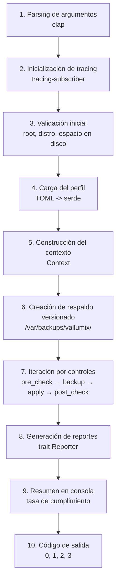

# Conceptos Clave

Antes de ejecutar Vallumix, es importante comprender los conceptos que rigen su funcionamiento. Esta sección explica la arquitectura mental del sistema: perfiles, controles, idempotencia, rollback y el flujo de ejecución completo.

## Flujo de ejecución

Cada vez que ejecutas Vallumix, el motor sigue un pipeline de 10 fases diseñado para ser predecible, seguro y auditable:



Este flujo garantiza que cada ejecución sea autónoma: valida el entorno, respalda antes de modificar, verifica después de aplicar y documenta todo en un reporte estructurado.

## ¿Qué significa cada fase?

1. **Parsing de argumentos:** `clap` valida flags, subcomandos y valores. Si hay un error sintáctico, el programa aborta antes de tocar el sistema.
2. **Inicialización de tracing:** configura el nivel de log y el formato (texto coloreado o JSON estructurado) según `RUST_LOG` y `--log-level`.
3. **Validación inicial:** comprueba que el usuario es root, que la distribución está soportada leyendo `/etc/os-release`, y que hay espacio suficiente en disco para respaldos.
4. **Carga del perfil:** deserializa el archivo TOML del perfil seleccionado (`web.toml`, `database.toml` o `bastion.toml`) y resuelve la lista de controles a ejecutar.
5. **Construcción del contexto:** reúne información del host (hostname, kernel, distribución) y la configura en una estructura `Context` que cada control recibirá.
6. **Creación de respaldo:** genera un directorio versionado con timestamp en `/var/backups/vallumix/`. Todos los archivos modificados se copian aquí antes de cualquier cambio.
7. **Iteración por controles:** para cada control del perfil, el motor ejecuta `pre_check` (¿ya cumple?), `backup` (copia de archivos), `apply` (aplica cambio), y `post_check` (¿funcionó?). En modo `audit`, solo ejecuta `pre_check`.
8. **Generación de reportes:** los traits `Reporter` producen los formatos solicitados (HTML, JSON, JUnit, texto).
9. **Resumen en consola:** muestra la tasa de cumplimiento, controles aprobados, fallidos y omitidos, junto con la ruta al reporte HTML.
10. **Código de salida:** `0` si cumple el umbral, `1` si no, `2` para errores de configuración, `3` para errores de privilegios.

## Conceptos relacionados

- **[Perfiles](profiles.md):** conjuntos preconfigurados de controles adaptados al rol del servidor.
- **[Controles](controls.md):** unidades atómicas de verificación y remediación, cada una implementando el trait `Control`.
- **[Idempotencia](idempotency.md):** propiedad que garantiza que ejecutar Vallumix varias veces produce el mismo estado final.
- **[Rollback](rollback.md):** mecanismo para revertir cambios aplicados mediante respaldos versionados.

```tip
Entender este flujo te ayuda a interpretar los logs, a diagnosticar fallos y a explicarle a un auditor cómo funciona la herramienta. No es necesario memorizarlo, pero sí tenerlo como referencia cuando revises una ejecución problemática.
```
